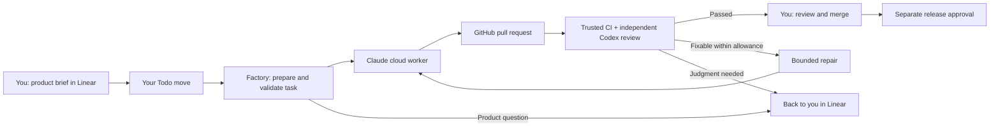

# Software Factory

**Turn product intent into reviewed code.**

Software Factory connects **Linear, Claude cloud workers, GitHub and Codex review** into a continuous delivery workflow for a product team of one. Write the ticket, define what success looks like, and move it to Todo. The factory coordinates implementation, checks the result, manages bounded repairs, and brings the change back for your review.

The ambition is simple: **spend your time shaping the product while the factory handles the engineering handoffs.**

> **Current stage:** The Linear intake, task preparation, cloud dispatch, independent Codex review, bounded repair and Linear reporting components are implemented and connected. The project is qualifying the full hosted workflow before its measured pilot. The initial configuration uses one pilot repository and one implementation lane; intake ships disabled until qualification.

## The delivery loop



**Linear is the front door. GitHub is the review surface. The factory keeps the work moving between them.**

1. **Describe the outcome.** Write a Linear ticket with acceptance criteria. Project policy supplies the repository, allowed scope and execution limits.
2. **Move it to Todo.** The factory verifies who made the transition and which version of the ticket they authorized. That decision becomes a signed record for the exact task.
3. **Prepare the work.** The controller turns the ticket into a precise implementation contract, chooses a checked base commit and validates scope, criteria and budget before dispatch.
4. **Build in the cloud.** A Claude worker implements the change in the pilot repository and opens a traceable pull request.
5. **Check independently.** Trusted CI checks the candidate. Codex reviews the implementation through a protected GitHub Actions workflow, with evidence tied to the exact contract and code revision.
6. **Repair within bounds.** Eligible failures can receive another implementation attempt within the task's signed allowance, after the previous writer is cleared. Product decisions and exceptions come back to you.
7. **Make the final call.** Linear carries progress, questions and the review handoff. You review and merge on GitHub; release approval remains a separate decision.

## What makes it a factory

Running agents is only part of delivering software. Someone still has to decide what they may change, connect their work to the original request, handle interruptions, check the result and know when it is ready. Software Factory makes those responsibilities part of the system.

### Product intent survives the handoffs

A task carries its requested outcome, acceptance criteria, permitted changes, starting commit and attempt budget. The controller binds that contract to an authenticated decision and follows it through dispatch, the worker's PR and review. Editing the requirements cannot silently rewrite an active task.

### Reviews have evidence behind them

A green build is one part of the picture. The verification code maps acceptance criteria to assertions or explicit human observations, checks for weakened tests and protected-control changes, and rejects stale or untrusted evidence. Independent review follows the actual candidate revision, so a new push or changed base requires a fresh assessment.

Claude implements; Codex supplies a separate review perspective. The controller checks review provenance and revision binding before using the result.

### Failure is part of the workflow

Restarts, lost responses, rate limits and failed checks have explicit handling. The factory records launch intent before contacting a worker and keeps uncertain launches on hold. An unanswered request never becomes permission to start a duplicate writer. Repairs consume the existing task budget, and unresolved decisions are reported in Linear.

### Progress lives where the work was defined

The originating ticket receives the task summary, progress, product questions and PR links. Durable message delivery survives interruptions without relaunching the work. Readiness names the reviewed commit, and a merge without applicable passing evidence is recorded as an exception.

### Human authority is built into the boundaries

The background controller and separate signer own execution and authorization records. Workers receive bounded tasks; they do not hold the controller's approval or release credentials. A Todo move authorizes its recorded scope and allowance. You retain product decisions, exceptions, merge review and release approval.

## A small core with substantial engineering behind it

The controller uses **Python 3.11+ and the standard library**, with **SQLite** for its durable event record. Cloud workers do the implementation; a separate Codex workflow supplies model-based review. The always-on service is packaged for **Fly.io**, so the intended product workflow does not depend on a laptop staying awake.

The repository includes more than **2,000 automated tests**, synthetic integration fixtures and seeded bypass attempts. They exercise authorization, recovery, duplicate prevention, budgets, review provenance and reporting. CI runs on Linux with Python 3.11 and 3.13. Hosted qualification adds the live evidence that local fixtures cannot establish.

| Layer | Responsibility |
|---|---|
| Linear intake and task preparation | Read authorized work, preserve requirements and produce a bounded task |
| Signer, dispatcher and attempt controls | Authenticate decisions, reserve execution and enforce limits |
| Claude cloud runtime | Implement the task and propose the change |
| GitHub CI, Codex review and verification | Check the candidate against its requirements and retained evidence |
| Recovery, SQLite ledger and Linear reporting | Preserve state, reconcile interruptions and explain progress |
| Human review and release | Decide what ships |

## Built today, growing deliberately

The current code brings together:

- Authenticated Linear Todo intake and deterministic preparation for bounded tickets.
- The existing Anthropic-hosted Claude Routine implementation path.
- Independent Codex review through a protected GitHub Actions workflow.
- Signed repair allowances, persistent attempt limits and unknown-writer holds.
- Linear progress, product questions, candidate observations and merge records.
- An always-on service, durable queue, recovery and ledger backups.

Two expansions are on the roadmap:

- **Richer product context:** captured Notion pages, project guidance and design screenshots shared with the worker and reviewer. Source capture and synthetic fixtures exist; end-to-end image consumption and semantic preparation remain in progress. Tickets requiring unsupported linked context are held explicitly.
- **A qualified worker pool:** Claude Code, Codex CLI, Cursor and Antigravity adapters, followed by bounded parallel work and checks of the combined changes. Provider qualification and parallel scheduling are planned capabilities, separate from the current Claude cloud lane.

The next milestone is the full **Linear-to-reviewed-change qualification**, followed by a measured pilot. The measure of success is practical: less active human coordination per accepted change, with product quality and human control intact.

## Explore the system

| Start here | What you will learn |
|---|---|
| [Linear intake](docs/intake.md) | How a Todo move becomes authenticated task authorization |
| [Task preparation](docs/prepare.md) | How ticket requirements become an implementation contract |
| [Independent review](docs/review.md) | How Codex review and verification produce a candidate verdict |
| [Bounded repairs](docs/repair.md) | When another attempt is allowed and when the factory stops |
| [Linear reporting](docs/reporting.md) | Progress, questions, observations and review handoffs |
| [Background service](docs/service.md) | Hosting, configuration, operation and recovery |
| [Failure qualification](docs/linear-failure-qualification.md) | Tested failure cases and remaining live evidence |
| [Captured context](docs/captured-context.md) | The foundation for richer briefs and visual inputs |
| [Contribution guide](CONTRIBUTING.md) | Development commands, code ownership and shared interfaces |

The [pilot application](https://github.com/rNavarrete/factory-pilot-demo) is separate from this controller repository. Architecture decisions and accepted historical sign-offs live under [docs/adr](docs/adr/); current component guides and qualification records describe the evolving Linear-first workflow.

## Develop locally

```sh
python3 -m unittest discover -s tests -t .
python3 -m pip install ruff==0.15.12
python3 -m ruff check .
python3 -m ruff format --check .
```

These tests use synthetic inputs and fake worker transports. Linux runs the complete signer/socket suite; unsupported platform cases are skipped on macOS. See the [service guide](docs/service.md) for one-time hosted setup and qualification before enabling live intake.
